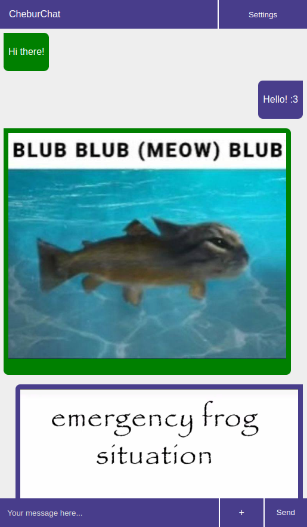

# CheburChat
CheburChat (pronounced cheh-boor-chat) is an offline local chat for your ESP board - almost like PictoChat on a DS! It works by creating a WiFi access point with a [captive portal](https://en.wikipedia.org/wiki/Captive_portal). Any modern device should be able to connect to it. It supports up to 256 users at once, works without internet and doesn't require anything from the client.

## Supported boards
|Name|PIO name|Supported|Tested|
|-|-|-|-|
|ESP32 Dev module|`esp32dev`|✅||
|Wemos D1 mini|`d1_mini`|✅|✅|

*You can help this project by testing or adding support for more boards!*

## Building and setup
First, install [PlatformIO](https://platformio.org/). Then, clone this project using `git clone`, open it in VSCode and in the PlatformIO menu (on the left side) select your board and:

- Click "General" -> "Upload"
- Wait for the build/upload process to finish (this also builds the frontend)
- Click "Platform" -> "Upload Filesystem Image"
- Wait for the upload process to finish

Then, connect to `CheburChat` and change the admin password. You can also change the settings if required. Note that after you save the settings, the board will reboot, so you'll have to connect again.

## Demo/functionality

Multiple message types are supported (as demonstrated above):
- Text
- Image
- Video
- Audio

You can also set a custom welcome message and change network settings in the "settings" menu on the top right.