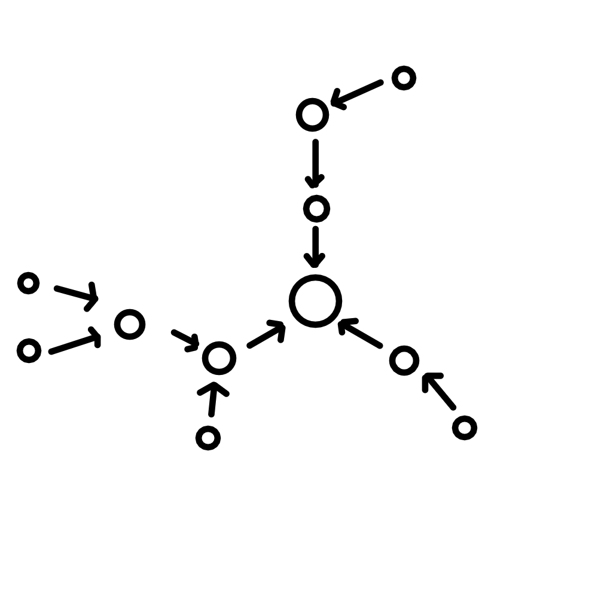

# CheburChat
CheburChat (pronounced cheh-boor-chat) is an offline local chat for your ESP board - almost like PictoChat on a DS! It works by creating a WiFi access point with a [captive portal](https://en.wikipedia.org/wiki/Captive_portal). Any modern device should be able to connect to it. It supports up to 256 users at once, works without internet and doesn't require anything from the client.

## Supported boards
|Name|PIO name|Supported|Tested|
|-|-|-|-|
|ESP32 Dev module|`esp32dev`|✅|✅|
|Wemos D1 mini|`d1_mini`|✅|✅|

*You can help this project by testing or adding support for more boards!*

## Building and setup
First, install [PlatformIO](https://platformio.org/) and [NodeJS](https://nodejs.org/en). Then, clone this project using `git clone`, install Node dependencies in `frontend/` using `npm i`, open it in VSCode and in the PlatformIO menu (on the left side) select your board and:

- Click "General" -> "Upload"
- Wait for the build/upload process to finish (this also builds the frontend)
- Click "Platform" -> "Build Filesystem Image" (*yes, this is necessary*)
- Wait for the build process to finish
- Click "Platform" -> "Upload Filesystem Image"
- Wait for the upload process to finish

Then, connect to `CheburChat` and change the admin password. You can also change the settings if required. Note that after you save the settings, the board will reboot, so you'll have to connect again.

## Demo/functionality

Multiple message types are supported (as demonstrated above):
- Text
- Image
- Video
- Audio

You can also set a custom welcome message and change network settings in the "settings" menu on the top right.

# "Mesh" networks
CheburChat devices can be connected into a mesh network (for sharing messages across multiple APs) where each device can connect to just one other device but can serve multiple other devices (so, a "tree" network). This is due to the limitations of ESP-8266s. Functionally, this is just like a mesh network with the only difference being worse performace.\
Here's a simple example of such a mesh network:

You can set up a mesh network by:

0. Making sure each device uses the same AP settings (SSID, password)
1. Collecting BSSIDs of each AP (`nmcli dev wifi` on Linux w/ NetworkManager)
2. Initializing the mesh network in each device's settings by specifying the BSSID that device needs to connect to
3. Restarting all devices, preferably starting from the one in the center

> Note: you can set up a very simple mesh network with two devices without collecting BSSIDs by initializing the mesh network on just one of them. However, you cannot do that with bigger networks, as this enables connection loops. These loops are detected by the devices themselves and they will reboot once they detect such a loop.